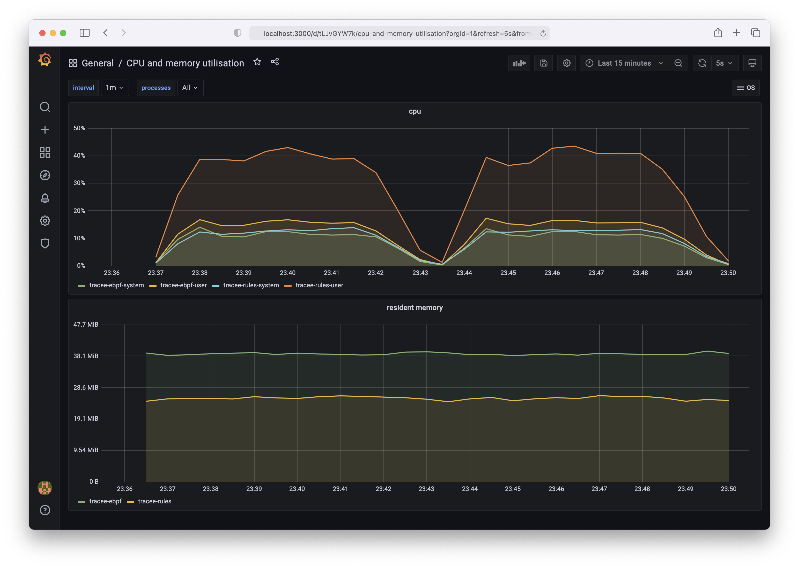

# Simple Linux Monitoring Stack



## Installation

```
git clone https://github.com/danielpacak/simple-linux-monitoring-stack.git
cd simple-linux-monitoring-stack
```

### Create configuration files


```
cat << EOF > process-exporter.yaml
process_names:
- exe:
    - tracee-ebpf
    - tracee-rules
EOF
```

```
cat << EOF > prometheus.yaml
global:
scrape_interval: 5s

scrape_configs:
- job_name: node
  static_configs:
    - targets: ['process-exporter:9256']
EOF
```

### Run with Docker

```
docker network create monitor
```

```
docker run --name process-exporter -d --rm --privileged \
  --network monitor -p 9256:9256 \
  -v /proc:/host/proc \
  -v $PWD:/config \
  ncabatoff/process-exporter:0.7.5 \
  --procfs /host/proc \
  -config.path /config/process-exporter.yaml
```

```
docker run --name prometheus -d --rm \
  --network monitor -p 0.0.0.0:9090:9090 \
  -v $PWD:/config \
  prom/prometheus:v2.28.1 \
  --config.file /config/prometheus.yaml
```

```
docker run --name grafana -d --rm \
  --network monitor -p 3000:3000 \
  grafana/grafana:8.0.5
```

### Run with Docker Compose

```
docker-compose up -d
```

Open [http://localhost:3000](http://localhost:3000) in your web browser to access Grafana.  
The default username and password are **admin** and **admin**.

## Test VM (macOS)

```
multipass launch --name tracee --cpus 2 --mem 4GB --disk 20G 20.04
```

```
sudo curl -L "https://github.com/docker/compose/releases/download/1.29.2/docker-compose-$(uname -s)-$(uname -m)" -o /usr/local/bin/docker-compose
sudo chmod +x /usr/local/bin/docker-compose
```

```
docker-compose -v
docker-compose version 1.29.2, build 5becea4c
```

```
sudo VBoxManage controlvm "tracee" natpf1 "grafana,tcp,,3000,,3000"
sudo VBoxManage controlvm "tracee" natpf1 "prometheus,tcp,,9090,,9090"
sudo VBoxManage controlvm "tracee" natpf1 "process-exporter,tcp,,9256,,9256"
```

## Test Workload (Tracee)


```
sudo ./tracee-ebpf/dist/tracee-ebpf --output=format:gob --security-alerts | ./tracee-rules/dist/tracee-rules --input-tracee=file:stdin --input-tracee=format:gob
```
